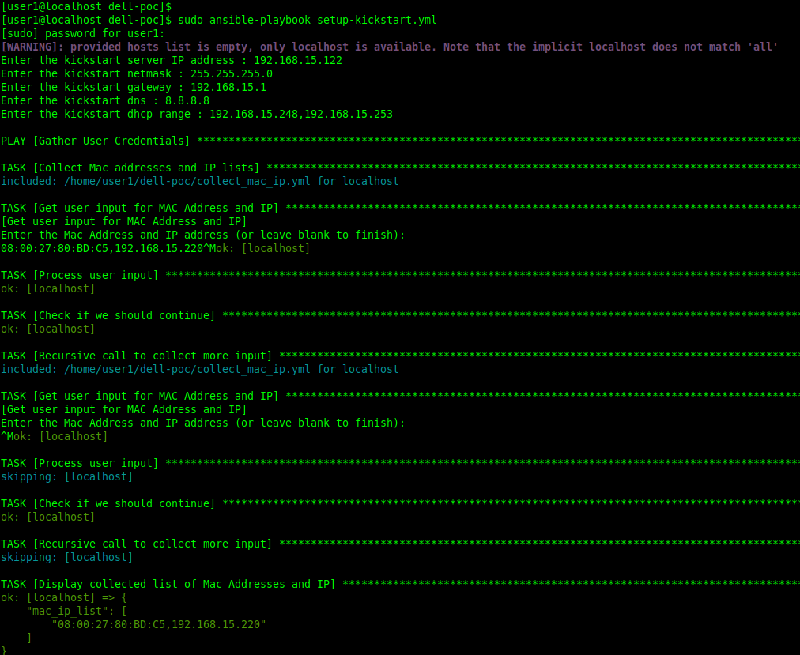
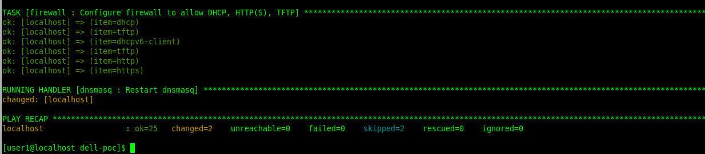

The playbook on this project will turn an existing Rocky 9 linux machine into a kickstart server provigind pxe boot (BIOS only).

Tested on Rocky 9.4 with Ansible 2.14.14

## Requirements
Ansible is required on the machine running the playbook.

On Rocky 9, you can install ansible by following the command below:

```
sudo dnf install -y epel-release
sudo dnf install -y ansible
```

## Installation
You can use the git clone command to clone this repository or download the zip file of the project.

## Usage

1) On the machine that will become the kickstart server, run the command below:

    `sudo ansible-playbook setup-kickstart.yml`

2) You will be prompted to enter the following information
    * Kickstart IP Address
        * Example: `192.168.15.122`
    * Kickstart Netmask. ( CDIR notation is not currently supported )
        * Example: `255.255.255.0`
    * Kicstart Gateway
        * Example: `192.168.15.1`
    * Kickstart DNS
        * Example: `8.8.8.8`
    * Kickstart dhcp range (comma seperated value of the begining and the end of the dhcp pool)
        * Example: `192.168.15.248,192.168.15.253`


    ```
    Enter the kickstart server IP address : 192.168.15.122
    Enter the kickstart netmask : 255.255.255.0
    Enter the kickstart gateway : 192.168.15.1
    Enter the kickstart dns : 8.8.8.8
    Enter the kickstart dhcp range : 192.168.15.248,192.168.15.253
    ```

3) You will be now prompted multiple times to enter your target server information
    * The target MAC Address and Ip addresses of the final server should follow the format below:

        `MAC_ADDRESS,IP_ADDRESS`
        
        * Example: `08:00:27:80:BD:C5,192.168.15.220`

    * A blank entry will allow you to contintue with the playbook when ready





4) When the playbook finishes running successfully you can boot your target server for installation.


5) The server build from this kickstart will have  the default user credentials below:

    username: `user`

    passowrd: `Passowrd1!`


## Configuration files location
* Kickstart configurat file
    * `/tftpboot/kickstart/ks.cfg`

* DHCP and TFTP 
    * `/etc/dnsmasq.conf`

* PXE Boot menu configuration
    * `/tftpboot/pxelinux.cfg/default`

## Log files
* DHCP and TFTP logs 
    * `/var/log/dnsmasq.log`

* Web server (nginx) logs : 
    * `/var/log/nginx/access.log` 
    * `/var/log/nginx/error.log`


## TODO   
    [] Validate MAC and IP addresses input
    [] Add UEFI support for pxe boot
    [] Check and setup yum/dnf repository if not set
 
